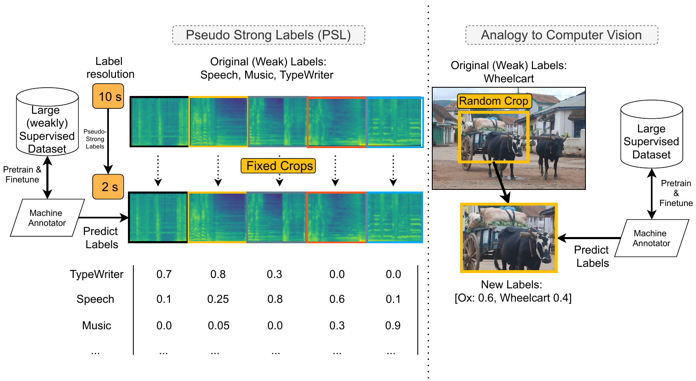

# Pseudo Strong Labels

This repository contains the source code for our ICASSP2022 paper "Pseudo strong labels for large scale weakly supervised audio tagging".




The aim of this work is to show that by adding automatic supervision on a fixed scale from a machine annotator (or teacher) to a student model, performance gains can be observed on Audioset.

Specifically, our method outperforms other approaches in literature on the ``balanced`` subset of Audioset, while using a rather simple MobileNetV2 architecture.


| Method                            |Label                                          |mAP        | $d'$ |
|  --------------------------------- | -------------------------------------- | ----------- | -----------|
|  Baseline (Weak)                   |$\mathbf{y}^{10}_{\text{weak}}$       |       17.69 |      1.994| 
|  PSL-10s (Proposed)                |$\hat{\mathbf{y}}^{10}_{\text{PSL}}$  |       31.13 |      2.454| 
|  PSL-5s (Proposed)                 |$\hat{\mathbf{y}}^{5}_{\text{PSL}}$   |       34.11 |      2.549| 
|  PSL-2s (Proposed)                 |$\hat{\mathbf{y}}^{2}_{\text{PSL}}$   |   **35.48** |  **2.588**| 
|  CNN14 [@Kong2020d]                |$\mathbf{y}^{10}_{\text{weak}}$       |       27.80 |      1.850| 
|  EfficientNet-B0 [@gong2021psla]   |                                      |       33.50 |         \-| 
|  EfficientNet-B2 [@gong2021psla]   |                                      |       34.06 |         \-| 
|  ResNet-50 [@gong2021psla]         |                                      |       31.80 |         \-| 
|  AST [@gong21b_interspeech]        |                                      |       34.70 |         \-| 


## Requirements


### Binary package requirements

[gnu-parallel](https://www.gnu.org/software/parallel/) for the preprocessing, which can be installed using conda:

```bash
conda install parallel
```

If you have root rights you can:


```bash
# On Arch distros
sudo pacman -S parallel 
# On Debian
sudo apt install parallel
```

Further, the download script in `scripts/1_download_audioset.sh` uses [Proxychains](https://github.com/haad/proxychains) to download the data. You might want to disable proxychains by simply removing the line or configure your own proxychains proxy.

### Python requirements

This script has been tested using `python=3.8` on a Centos 5 and Manjaro.
To install the python dependencies just run:

```bash
python3 -m pip install -r requirements.txt
```


## Training preparation

The structure of this repo is as follows:

```
.
├── configs
├── data
│   ├── audio
│   │   ├── balanced
│   │   └── eval
│   ├── csvs
│   └── logs
├── figures
├── scripts
│   └── utils
```

### [Optional] Preparation without downloading the dataset

If already have downloaded audioset, please put the raw data of the balanced and eval subsets in `data/audio/balanced` and `data/audio/eval` respectively.
Then put `balanced_train_segments.csv`, `eval_segments.csv` and `class_labels_indices.csv` into `data/csvs`.

### 1. Download Data

Firstly, you need the balanced and evaluation subsets of audioset. 
These can be downloaded using the following script:

```bash
./scripts/1_download_audioset.sh
```

### 2. Prepare HDF5 

In order to speed up IO, we pack the data into hdf5 files.
This can be done by:

```bash
./scripts/2_prepare_data.sh
```

## Usage


For the experiments in Table 2, run:

```bash
## For the 10s PSL training
./train_psl.sh configs/psl_balanced_chunk_10sec.yaml
## For the 5s PSL training
./train_psl.sh configs/psl_balanced_chunk_5sec.yaml
## For the 2s PSL training
./train_psl.sh configs/psl_balanced_chunk_2sec.yaml
```

For the experiments in Table 3, run:

```bash
## For the 10s PSL training
./train_psl.sh configs/teacher_student_chunk_10sec.yaml
## For the 5s PSL training
./train_psl.sh configs/teacher_student_chunk_5sec.yaml
## For the 2s PSL training
./train_psl.sh configs/teacher_student_chunk_2sec.yaml
```

Note that this repo can be easily extended to run the experiments in Table 4, i.e., using the full Audioset dataset.


